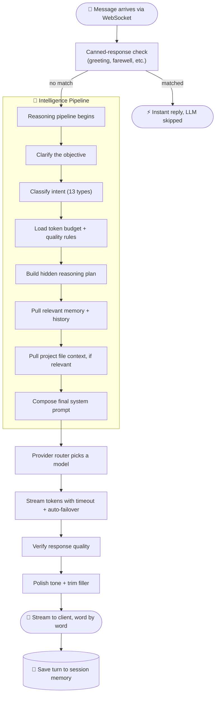
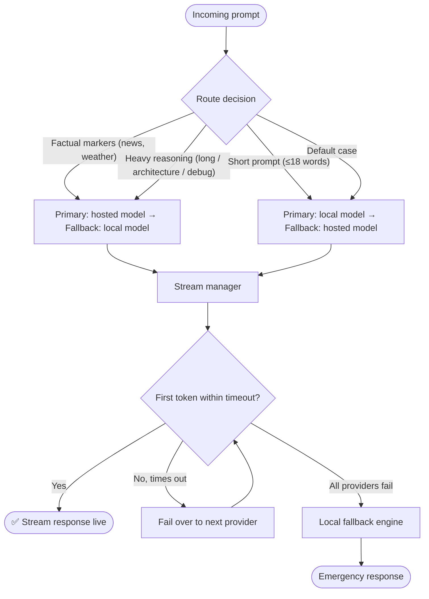

<div align="center">


<a href="#">
  
</a>

<br/><br/>


</div>

<br/>

<table width="100%">
<tr>
<td align="center" width="100%">

### 🚧 &nbsp; This project is a **work in progress**
Core systems already run end-to-end, but parts of the codebase are unfinished, mid-refactor, or contain known bugs.
Everything currently broken or incomplete is tracked openly in **[Known Issues & Gaps](#-known-issues--gaps)**.

</td>
</tr>
</table>

<br/>

## 🧭 Explore This README

<table width="100%">
<tr>
<td width="33%" valign="top">

**🌌 The Basics**
- [What is Friday?](#-overview)
- [Backend Structure](#-backend-structure)
- [Request Lifecycle](#-request-lifecycle)

</td>
<td width="33%" valign="top">

**🧠 The Brain**
- [Request Classifier](#-request-classifier)
- [Memory System](#-memory-system)
- [Project Awareness](#-project-awareness)
- [Response Verification](#-response-verification)
- [Personality Modes](#-personality-modes)

</td>
<td width="33%" valign="top">

**⚙️ The Engine Room**
- [Provider Routing](#-provider-routing)
- [Live Telemetry](#-live-telemetry)
- [Boot Greeting](#-boot-greeting)
- [Sleep / Wake Commands](#-sleep--wake-commands)

</td>
</tr>
<tr>
<td width="33%" valign="top">

**📋 The Status Report**
- [What's Working](#-whats-working)
- [Known Issues & Gaps](#-known-issues--gaps)

</td>
<td width="33%" valign="top">

**🗺 What's Next**
- [Roadmap](#-roadmap)

</td>
<td width="33%" valign="top">

&nbsp;

</td>
</tr>
</table>

<br/>

## 🌌 Overview

**Friday** is a self-hosted AI assistant backend built around one idea: *the assistant should actually understand the conversation, the machine it's running on, and its own codebase — not just forward text to an API.*

Every message goes through a full pipeline: intent classification → memory recall → live project-file context → provider routing with automatic failover → automated quality verification → personality polish → word-by-word streaming. Along the way, it reads **real hardware telemetry** (CPU, RAM, battery, thermals) so its awareness of "what's happening right now" is grounded in actual data, not guesses.

<br/>

<div align="center">

</div>

<div align="center"><sub>⬆️ a real turn through the pipeline, simulated live</sub></div>

<br/>

## 🗂 Backend Structure

<table width="100%">
<tr><th align="left">Layer</th><th align="left">Folder</th><th align="left">Responsibility</th></tr>
<tr><td>🚪 Entry Point</td><td><code>app.py</code>, <code>config.py</code>, <code>schemas.py</code>, <code>security.py</code>, <code>logging_config.py</code></td><td>FastAPI + WebSocket server, environment config, request/response models, auth, structured logs</td></tr>
<tr><td>🧠 Intelligence</td><td><code>intelligence/</code></td><td>Orchestration, intent classification, task profiles, memory, project context, verification</td></tr>
<tr><td>📡 Providers</td><td><code>providers/</code></td><td>LLM provider clients, routing logic, streaming contracts, offline fallback engine</td></tr>
<tr><td>🛠 Services</td><td><code>services/</code></td><td>Turn handling, personality/response modes, telemetry, TTS, symbolic math, voice detection</td></tr>
<tr><td>♻️ Runtime</td><td><code>runtime/</code></td><td>State machine, session memory, event bus, background tasks, telemetry history</td></tr>
</table>

<details>
<summary>📁 <b>Click to expand the full file tree</b></summary>

```
backend/
├── app.py                     FastAPI server, WebSocket handler, boot logic
├── config.py                  Environment config (API keys, models, paths)
├── schemas.py                 Pydantic request/response models
├── security.py                Admin auth guard
├── logging_config.py          Structured logging
│
├── intelligence/
│   ├── reasoning_engine.py     Master orchestrator
│   ├── request_classifier.py   Rule-based intent classifier (13 types)
│   ├── task_profiles.py        Per-task token budgets + quality rules
│   ├── memory_intelligence.py  Long-term + session memory
│   ├── project_intelligence.py Reads project files for live context
│   └── verification_engine.py  Rule-based quality checker
│
├── providers/
│   ├── provider_manager.py     Streaming + auto-failover
│   ├── provider_router.py      Routes prompt to best provider
│   ├── openai_provider.py      GPT-4o-mini
│   ├── perplexity_provider.py  Web search / factual
│   ├── ollama_provider.py      Local model (llama3.2)
│   ├── fallback_engine.py      Rule-based offline brain
│   └── unified_stream.py       BaseProvider + streaming contracts
│
├── services/
│   ├── assistant_service.py    Main turn handler + streamer
│   ├── response_modes.py       System prompt composer + personality
│   ├── system_telemetry.py     Live CPU/RAM/battery/weather/process data
│   ├── speech_engine.py        Backend TTS
│   ├── sympy_solver.py         Symbolic math engine
│   └── voice_processor.py      Voice activity detection
│
└── runtime/
    ├── state.py                 booting → ready → thinking → speaking → idle
    ├── sessions.py               Per-user session + conversation memory
    ├── events.py                 Public/private event bus
    ├── tasks.py                  Background task tracking
    └── telemetry.py              Event history store
```

</details>

<br/>

## 🔄 Request Lifecycle

<div align="center">



</div>


## 🧠 Request Classifier

A rule-based classifier ranks 13 possible intents by priority and signal strength. Confidence starts at **0.45** and rises to **0.98** — it never overstates certainty.

<div align="center">

</div>

<div align="center"><sub>⬆️ the classifier reasoning about a few sample messages</sub></div>

<br/>

<table width="100%">
<tr><th width="8%">#</th><th width="27%">Intent</th><th width="65%">Detected From</th></tr>
<tr><td align="center">1</td><td><code>project_analysis</code></td><td>"this project", "our code", "codebase"</td></tr>
<tr><td align="center">2</td><td><code>code_review</code></td><td>"review this code", "find bugs", "audit"</td></tr>
<tr><td align="center">3</td><td><code>debugging</code></td><td>"bug", "error", "traceback", "not working"</td></tr>
<tr><td align="center">4</td><td><code>game_development</code></td><td>"snake", "chess", "game loop", "tic tac toe"</td></tr>
<tr><td align="center">5</td><td><code>architecture</code></td><td>"microservices", "scalable", "system design"</td></tr>
<tr><td align="center">6</td><td><code>coding</code></td><td>"python", "implement", "react", "fastapi"</td></tr>
<tr><td align="center">7</td><td><code>mathematics</code></td><td>numeric expression pattern</td></tr>
<tr><td align="center">8</td><td><code>research</code></td><td>"latest", "news", "today", "compare"</td></tr>
<tr><td align="center">9</td><td><code>decision_making</code></td><td>"should I", "pros and cons", "recommend"</td></tr>
<tr><td align="center">10</td><td><code>planning</code></td><td>"roadmap", "break down", "milestones"</td></tr>
<tr><td align="center">11</td><td><code>creative</code></td><td>"write a story", "poem", "brainstorm"</td></tr>
<tr><td align="center">12</td><td><code>knowledge</code></td><td>"what is", "explain", "how does"</td></tr>
<tr><td align="center">13</td><td><code>conversation</code></td><td>"hello", "thanks", "how are you"</td></tr>
</table>

<br/>

## 💾 Memory System

Two memory layers, retrieved using term-overlap scoring plus time-decay — recent and frequently referenced facts rank higher.

<table width="100%">
<tr><th align="left">Layer</th><th align="left">Scope</th><th align="center">Capacity</th></tr>
<tr><td><b>Session facts</b></td><td>Only within the current conversation</td><td align="center">50 facts</td></tr>
<tr><td><b>Global facts</b></td><td>Across all sessions (in-memory)</td><td align="center">200 facts</td></tr>
</table>

<table width="100%">
<tr>
<td width="50%" valign="top">

**✅ Gets remembered**
- "Remember that my name is Ryan"
- "My goal is to build an AI assistant"
- "I prefer dark mode UI"
- Stated long-term preferences and goals

</td>
<td width="50%" valign="top">

**🚫 Gets ignored (transient)**
- Simple one-off questions ("what is X?")
- Short greetings ("hi", "ok", "yes")
- Debugging code snippets pasted in chat

</td>
</tr>
</table>

> 🐞 **Known bug:** `memory_intelligence.py` line 136 contains an unreachable `return None` sitting right after the real return statement. Harmless, but dead code that should be cleaned up.

<br/>

## 📚 Project Awareness

When a query references the project, codebase, or architecture, the system:

1. Activates project-context mode
2. Scans `.py`, `.ts`, `.tsx`, `.js`, `.md`, `.json` files
3. Scores files by relevance to the query (up to **6 files**, **7,200 characters** total)
4. Injects the real file excerpts directly into the model's system prompt

This lets it answer questions like *"how does our provider failover work?"* by reading the actual source — not guessing.

<br/>

## ✅ Response Verification

Every generated response starts at a quality score of **96** and is docked for specific issues:

<table width="100%">
<tr><th align="left">Check</th><th align="left">Applies To</th><th align="center">Penalty</th></tr>
<tr><td>Empty response</td><td>All request types</td><td align="center">−70</td></tr>
<tr><td>Missing code block</td><td>coding, game_development</td><td align="center">−18</td></tr>
<tr><td>Response looks incomplete</td><td>All except conversation</td><td align="center">−14</td></tr>
<tr><td>Missing explanation</td><td>debugging, coding, architecture</td><td align="center">−12</td></tr>
<tr><td>Missing edge cases</td><td>coding, architecture</td><td align="center">−10</td></tr>
<tr><td>Debugging without root cause</td><td>debugging</td><td align="center">−16</td></tr>
<tr><td>Code review missing findings</td><td>code_review</td><td align="center">−18</td></tr>
</table>

After scoring, the response is also cleaned of generic AI disclaimers before it's sent onward.

<br/>

## 🎭 Personality Modes

<table width="100%">
<tr><th align="left">Mode</th><th align="left">Triggered By</th><th align="left">Behavior</th></tr>
<tr><td><code>casual</code></td><td>General chat</td><td>Short, warm, grounded</td></tr>
<tr><td><code>math</code></td><td>Math expressions</td><td>LaTeX formatting, step-by-step</td></tr>
<tr><td><code>system</code></td><td>"cpu", "battery", "ram"</td><td>Live telemetry injected into the prompt</td></tr>
<tr><td><code>bullet</code></td><td>"give me points", "as bullets"</td><td>3–5 concise bullet points</td></tr>
<tr><td><code>compact</code></td><td>"be concise", "one line"</td><td>1–2 sentences maximum</td></tr>
<tr><td><code>technical</code></td><td>"architecture", "debug", "websocket"</td><td>Precise, implementation-aware</td></tr>
<tr><td><code>cinematic</code></td><td>"mission", "dramatic"</td><td>Restrained, no theatrics</td></tr>
</table>

**Core tone:** warm, attentive, emotionally aware, and collaborative — without tipping into overly sentimental.


## 📡 Provider Routing

<div align="center">



</div>

<table width="100%">
<tr><th align="center">Tier</th><th align="left">Provider</th><th align="left">Role</th></tr>
<tr><td align="center">1</td><td><b>Hosted model</b> (GPT-4o-mini)</td><td>Primary reasoning engine</td></tr>
<tr><td align="center">2</td><td><b>Search-augmented model</b> (Perplexity, sonar-small-chat)</td><td>Web search / factual lookups</td></tr>
<tr><td align="center">3</td><td><b>Local model</b> (Ollama, llama3.2)</td><td>Fast, offline, private</td></tr>
<tr><td align="center">4</td><td><b>Local fallback engine</b></td><td>Rule-based, no LLM required</td></tr>
<tr><td align="center">5</td><td><b>Emergency provider</b></td><td>Absolute last resort</td></tr>
</table>

⏱️ First-token timeout: **2 seconds** for hosted providers, **8 seconds** for the local model — a slow provider fails over quickly so a response always comes back.

<div align="center">

</div>

<div align="center"><sub>⬆️ what a failover actually looks like when the primary provider stalls</sub></div>

<br/>

## 🏃 Live Telemetry

<table width="100%">
<tr><th align="left">Signal</th><th align="left">Source</th><th align="center">Accuracy</th></tr>
<tr><td>CPU load</td><td><code>os.getloadavg()</code>, normalized</td><td align="center">Real</td></tr>
<tr><td>RAM usage</td><td><code>vm_stat</code> + page-size parsing</td><td align="center">Real</td></tr>
<tr><td>Battery</td><td><code>pmset -g batt</code> parsing</td><td align="center">Real</td></tr>
<tr><td>Internet status</td><td>DNS socket connect test</td><td align="center">Real</td></tr>
<tr><td>Time of day</td><td>System clock</td><td align="center">Real</td></tr>
<tr><td>Weather</td><td>External weather API (0.8s timeout)</td><td align="center">Real, fixed location</td></tr>
<tr><td>Thermal state</td><td><code>powermetrics</code>, with safe fallback</td><td align="center">Real when available</td></tr>
<tr><td>Top processes</td><td><code>ps -Aceo pcpu,comm</code></td><td align="center">Real</td></tr>
<tr><td>Workload category</td><td>Process-name matching</td><td align="center">Inferred</td></tr>
</table>

<br/>

## 🌅 Boot Greeting

On startup, the system builds a situational greeting instead of a static one:

<table width="100%">
<tr><td align="center" width="8%">1</td><td>Reads live telemetry — CPU, RAM, battery, thermal, processes</td></tr>
<tr><td align="center">2</td><td>Determines time of day — dawn, morning, afternoon, evening, night</td></tr>
<tr><td align="center">3</td><td>Infers current workload — coding, rendering, light use, etc.</td></tr>
<tr><td align="center">4</td><td>Picks an opening line at random</td></tr>
<tr><td align="center">5</td><td>Builds an observation from the most notable signal</td></tr>
<tr><td align="center">6</td><td>Streams it naturally to the user</td></tr>
</table>

**Example of a real generated greeting, typed out the way it streams to the user:**

<div align="center">

</div>

Nothing here is templated text — every greeting reflects the actual machine state at that moment.

<br/>

## 😴 Sleep / Wake Commands

<table width="100%">
<tr><th align="left">Command</th><th align="left">Effect</th></tr>
<tr><td>"sleep", "shutdown", "goodnight", "stand by"</td><td>Enters sleep mode; ignores incoming messages</td></tr>
<tr><td>Wake phrase</td><td>Resumes from sleep mode</td></tr>
<tr><td>"stop", "pause", "be quiet"</td><td>Immediately cancels the current response stream</td></tr>
</table>

Both sleep and wake responses are randomly picked from a small set of variations, so they don't feel scripted.

<br/>

## 🟢 What's Working

<table width="100%">
<tr><td>✅ Streaming WebSocket pipeline — solid cancellation and interruption handling</td></tr>
<tr><td>✅ Automatic multi-tier failover across providers, down to a fully offline fallback</td></tr>
<tr><td>✅ Real-time telemetry powering a genuinely dynamic boot greeting</td></tr>
<tr><td>✅ Canned-response routing bypasses the LLM entirely for greetings/status checks</td></tr>
<tr><td>✅ Personality engine with filler removal and tone control</td></tr>
<tr><td>✅ Symbolic math engine — guaranteed-correct results, not LLM-guessed math</td></tr>
<tr><td>✅ Live project-file awareness for codebase-related questions</td></tr>
<tr><td>✅ Memory system that captures user preferences and goals</td></tr>
</table>

<br/>


## 🔴 Known Issues & Gaps

<table width="100%">
<tr><th align="left">Issue</th><th align="left">Location</th><th align="center">Severity</th></tr>
<tr><td>Legacy internal naming still lingers in a few modules and hasn't been fully migrated</td><td>Several service files</td><td align="center">🔴 High</td></tr>
<tr><td>Unreachable dead-code line after a return statement</td><td><code>memory_intelligence.py</code></td><td align="center">🟡 Medium</td></tr>
<tr><td>All memory lives in RAM only and is lost on restart; the on-disk database exists but isn't connected</td><td><code>memory_intelligence.py</code></td><td align="center">🟡 Medium</td></tr>
<tr><td>Weather location is hardcoded, with no user-configurable setting</td><td><code>assistant_service.py</code>, <code>system_telemetry.py</code></td><td align="center">🟡 Medium</td></tr>
<tr><td>Only the last 6 messages of conversation are passed to the model; older context is dropped</td><td><code>provider_manager.py</code></td><td align="center">🟡 Medium</td></tr>
<tr><td>Offline fallback engine only recognizes a small, fixed set of topics</td><td><code>fallback_engine.py</code></td><td align="center">🟡 Medium</td></tr>
<tr><td>Provider timeout is tight enough that a normal slow response can trigger an unnecessary failover</td><td><code>config.py</code></td><td align="center">🟡 Medium</td></tr>
<tr><td>Search-augmented provider is wired up but never actually selected by the router</td><td><code>provider_router.py</code></td><td align="center">🟡 Medium</td></tr>
<tr><td>A local-first routing flag is hardcoded off, disabling an intended routing path</td><td><code>assistant_service.py</code></td><td align="center">🟢 Low</td></tr>
<tr><td>A per-process session tracking set is never cleared, growing unbounded over long uptimes</td><td><code>app.py</code></td><td align="center">🟢 Low</td></tr>
<tr><td>Weather fetch timeout is very tight, risking stale data on a slow network</td><td><code>system_telemetry.py</code></td><td align="center">🟢 Low</td></tr>
</table>

<br/>

## 🗺 Roadmap

<table width="100%">
<tr><td>⬜ Complete the internal naming/rebrand migration across all backend modules</td></tr>
<tr><td>⬜ Connect the on-disk database so memory survives a restart</td></tr>
<tr><td>⬜ Make weather location user-configurable instead of fixed</td></tr>
<tr><td>⬜ Expand the conversation context window beyond the last 6 messages</td></tr>
<tr><td>⬜ Actually route to the search-augmented provider when relevant</td></tr>
<tr><td>⬜ Re-tune provider timeouts to cut down on false failovers</td></tr>
<tr><td>⬜ Grow the offline fallback engine's knowledge base</td></tr>
<tr><td>⬜ Clean up dead code paths flagged in the issues table</td></tr>
<tr><td>⬜ Add session cleanup so long-running processes don't leak memory</td></tr>
</table>

<br/>

<div align="center">


<br/>

### Actively built, actively improved — and not finished yet.


</div>
